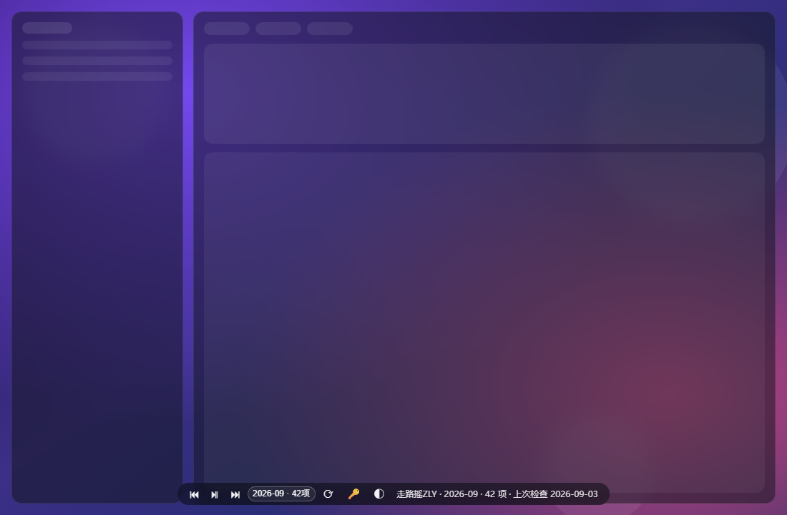
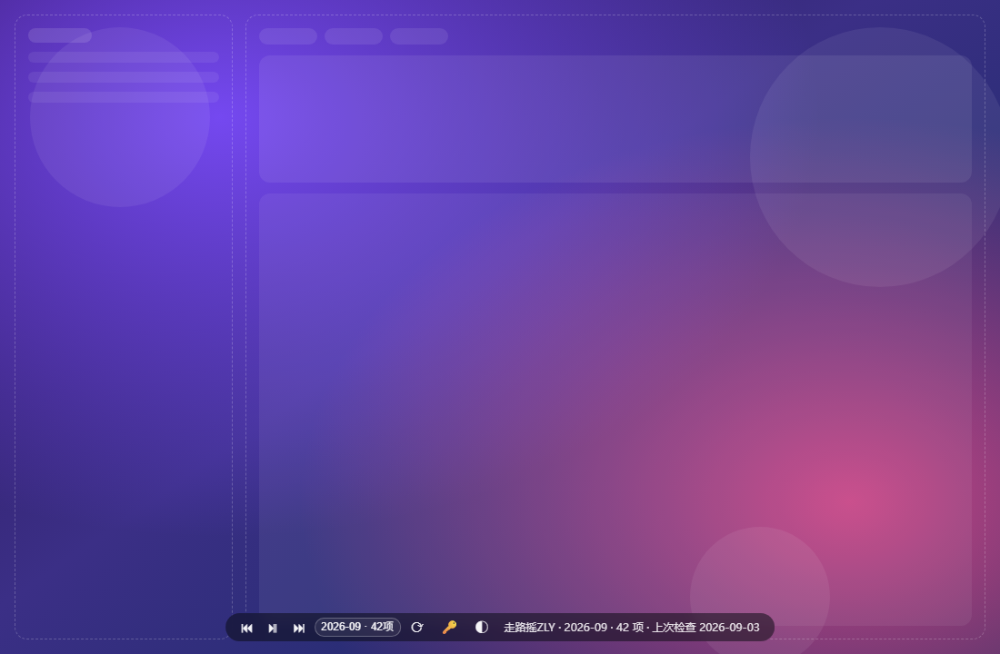
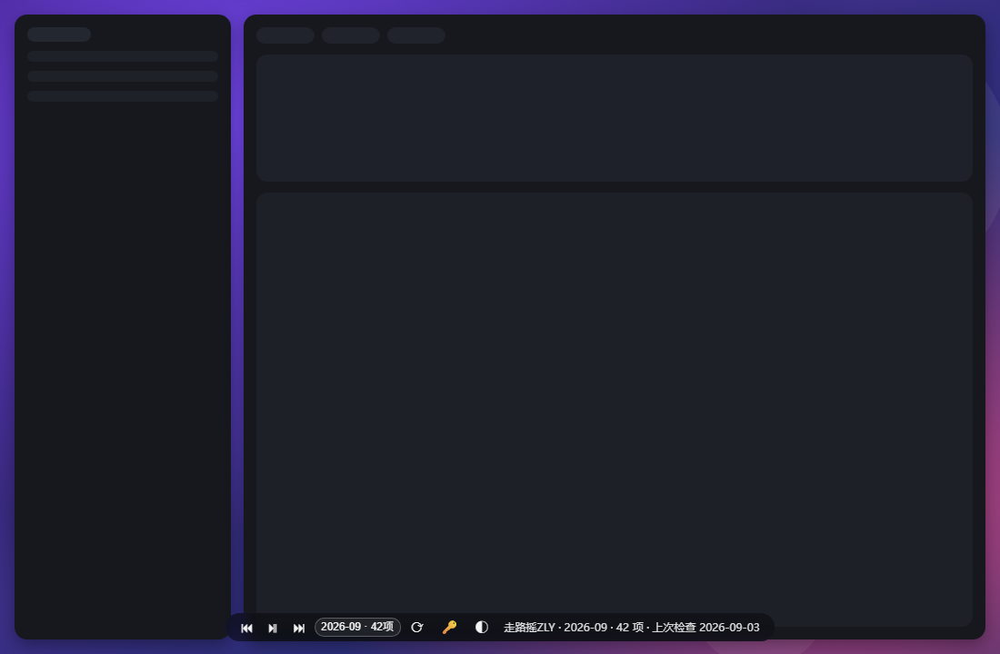

# weibo-wallpaper-dsh · 微博相册壁纸(DSH Web 界面)

把微博博主的相册/微博媒体变成 **DeepSeek Harness(DSH)Web 界面壁纸**的宿主插件。

- 每次打开 DSH 自动检查微博:同一天跳过,跨天/跨月增量下载,按月归档到本地 `YYYY-MM` 文件夹
- 首次启用自动回填**今年 1 月 ~ 上个月**的历史相册(断点续传、已存在文件跳过)
- 支持**多博主**:一个插件、一个你本人的微博 Cookie,即可同时跟踪多位博主(每人独立文件夹与状态)
- 三种显示模式 + 月份切换 + 免手动刷新,控制条常驻页面底部

> English: A DSH (DeepSeek Harness) host plugin that syncs a Weibo blogger's album/media by month into local `YYYY-MM` folders and shows them as the wallpaper behind the DSH web UI. Cookie is required and stays local. Still under active development — feedback welcome.

> **Language**: [中文](#目录) · [English](#english-documentation)
>
> ⭐ **如果这个项目对你有帮助,欢迎点个 Star** —— 它是作者持续开发的动力。(完整英文版见文末 `#english-documentation`。)

---

## 效果预览

> 以下为离线界面示意(深色主题下渲染),实际观感以你的 DSH 主题与壁纸内容为准。

| 毛玻璃(glass)| 全透明(clear)| 全遮挡(solid)|
|---|---|---|
|  |  |  |

控制条按钮从左到右:上一张 ⏮ · 播放/暂停 ⏯ · 下一张 ⏭ · 切换博主(多博主时出现) · 切换月份 · 立即检查 ⟳ · 设置 Cookie 🔑 · 显示模式(点击循环切换)。三种模式图标与含义:

| 模式 | 图标 | 效果 |
|---|---|---|
| 全遮挡 solid | ● | 界面保持默认不透明,壁纸被完全遮挡(相当于关闭壁纸) |
| 半透明毛玻璃 glass | ◐ | 默认模式:界面变半透明 + 毛玻璃模糊,壁纸透出 |
| 全透明 clear | ◯ | 界面完全透明,壁纸直接铺满背景 |

> 📸 **真实运行截图(TODO)**:上方为离线界面示意。壁纸在你的 DSH 上跑起来后,用系统截图工具(Snipping Tool / Win+Shift+S)截取真实页面,保存为 `docs/screenshots/live-dark.png`、`live-light.png`,并把上表换成真实截图(欢迎提交 PR)。`docs/social-preview.png` 为 1280×640 社交预览图,可上传到 GitHub 仓库设置 → Social preview。

---

## 目录

1. [功能特性](#功能特性)
2. [工作原理与数据布局](#工作原理与数据布局)
3. [安装(给别人用)](#安装给别人用)
4. [配置 config.json](#配置-configjson)
5. [获取微博 Cookie](#获取微博-cookie)
6. [使用流程](#使用流程)
7. [注意事项](#注意事项)
8. [风险与免责](#风险与免责)
9. [优势](#优势)
10. [常见问题 Troubleshooting](#常见问题-troubleshooting)
11. [项目结构与开发](#项目结构与开发)
12. [持续开发与反馈](#持续开发与反馈)
13. [开源协议](#开源协议)

---

## 功能特性

- **随进程常驻,不依赖任何会话**:插件注册在 DSH profile 层,打开 DSH 即运行;壁纸/控制条不再依赖某个 Agent 会话是否在线。
- **打开即显示、免刷新**:宿主级引导补丁(`zly-wallpaper-boot`)轮询引擎状态,页面一旦就绪自动挂载壁纸层;已打开的旧页面也能自愈出现壁纸。
- **按天幂等检查**:同一天只检查一次微博;同月新内容增量入库,同名文件跳过;跨月自动新建 `YYYY-MM` 文件夹。
- **每年历史回填**:启动后自动把**今年 1 月…上月**按 `YYYY-MM` 全部归档;断点续传(记录页码),一次没翻完,下次打开自动继续;已下载文件不会重复下载。
- **多博主**:`config.json` 里可配置任意博主列表(uid + 名字),每位博主拥有独立子目录 `state.json` 与 `albums/`;控制条下拉即可切换当前壁纸博主。
- **三模式显示**(见上表)+ **任意月份切换**;每次打开 DSH 自动展示**最新有内容的月份**。
- **媒体服务**:引擎自建 `/zly-wallpaper/*` HTTP 路由,本地图片/视频直接由 DSH 进程伺服,视频自动静音循环/续播下一张。
- **隐私第一**:代码不上传任何数据,只访问微博公开接口与你自己的本地目录;Cookie 只落本地磁盘(见[风险](#风险与免责))。
- **免第三方依赖**:纯 Node 原生 `fs`/`fetch` 实现,不引入任何 npm 运行时依赖。

## 工作原理与数据布局

DSH 基于 Cordis 组合。本插件以**用户 profile 补丁层**的两个插件行存在(`cordis.patch.yml` 的 `- insert:`),随 profile 启动即被 Cordis 挂载:

| 插件 | 作用 |
|---|---|
| `zly-wallpaper-engine` | 引擎本体:同步/回填/多博主/HTTP 路由/向 index 注入壁纸层 |
| `zly-wallpaper-boot` | 引导补丁:对每个页面注入 `boot.js`,免刷新自动挂载壁纸 |

数据布局(`root` 由 `config.json` 指定):

```
<root>/ui.json                            展示偏好(模式/间隔/当前博主/所选月份)
<root>/<uid>/state.json                   该博主抓取状态(含 Cookie,勿外传、勿入库)
<root>/<uid>/albums/<YYYY-MM>/...         该博主的按月媒体(文件名 = 日期_媒体ID.扩展名)
```

> 旧版(v2,单博主平铺为 `<root>/state.json` + `<root>/albums`)会在首次启动时**自动迁移**到 `<uid>/` 子目录,无需手动搬文件。

## 安装(给别人用)

### 前置条件

- 一个可用的 DSH 安装及其 **Web GUI profile**(常见名为 `web`),支持用户补丁层 `cordis.patch.yml`
- Node ≥ 18(DSH 内置运行时即满足;插件跑在 DSH 进程内)
- 一个微博账号(用于获取 Cookie,见下文)

### 步骤

1. **定位你的 profile 目录**
   - Windows 一般:`%USERPROFILE%\.dsh\profiles\<profile名>\`,例如 `C:\Users\<你>\.dsh\profiles\web\`
   - macOS/Linux 一般:`~/.dsh/profiles/<profile名>/`
   - 判断依据:该目录下应存在 `cordis.patch.yml`(或你将要创建它)与 profile 的 `package.json`。

2. **复制插件目录**:把本仓库 `plugins/` 下的 **两个目录**(`zly-wallpaper-engine/`、`zly-wallpaper-boot/`,连同各自的 `package.json`)原样复制到 profile 目录,与补丁文件同一层。

3. **合并补丁行**:把 `install/cordis.patch.snippet.yml` 中的 `- insert:` 条目合并进 profile 的 `cordis.patch.yml`(或 `$DSH_HOME/cordis.patch.yml`,作用于本机所有 profile)。
   - 不要整体覆盖已有文件(里面可能已有你的其它补丁);
   - 若文件为空/只有注释,直接改成包含 `- insert:` 的数组(空文件会导致启动失败)。

4. **生成配置**:在 `zly-wallpaper-engine/` 内把 `config.example.json` 复制为 `config.json` 并修改(见[下一节](#配置-configjson))。

5. **重启 DSH profile**(不是只关标签页)。启动后浏览器打开 DSH 页面即可看到壁纸;若该标签页是重启前打开的,按一次 F5 装上引导脚本,之后无需再刷新。

> ⚠️ **为什么每个插件目录都要自带 package.json(含 name 与 version)?** DSH 的插件清单会在每次模型请求时解析每个活动本地插件行;若最近的 package.json 只有 `name` 没有 `version`,会抛 `REQUEST_EXTENSION`(报错形如 “DeepSeek request extension preparation failed”),导致**所有模型请求失败**。本仓库已配好,请勿删改。

## 配置 config.json

文件位置:`<profile>/zly-wallpaper-engine/config.json`。缺省行为:不提供该文件时,`root` 默认 `~/.dsh/weibo-wallpaper`,博主默认走路摇ZLY。最小示例:

```json
{
  "root": "D:/your/path/weibo-wallpaper-data",
  "blogs": [
    { "uid": "1909576453", "name": "走路摇ZLY" }
  ]
}
```

- `root`: 本地保存根目录(建议放在仓库之外,避免误提交)。留空 `""` 用默认值。
- `blogs`: 要跟踪的博主数组。**想加博主就把 uid 与名字加进数组**,引擎会为每个 uid 单独建目录、单独检查与回填:

```json
{
  "root": "D:/your/path/weibo-wallpaper-data",
  "blogs": [
    { "uid": "1909576453", "name": "走路摇ZLY" },
    { "uid": "5611884883", "name": "另一个博主" }
  ]
}
```

`uid` 即微博用户数字 ID(打开博主主页 URL `weibo.com/u/<数字>` 可得);`name` 仅用于界面显示(引擎也会尝试从微博资料接口读取真实昵称)。
Cookie 不属于本文件:它由页面 🔑 按钮写入,存在 `<root>/<uid>/state.json`。

## 获取微博 Cookie

本项目使用 **m.weibo.cn 的移动端网页接口**,需要你本人的登录 Cookie(用于通过接口风控;内容可见范围 = 你账号能看到的内容)。

1. 用浏览器打开并登录 `https://m.weibo.cn`(**必须是 m.weibo.cn**,不是 www.weibo.com);
2. 按 `F12` 打开开发者工具 → `Network`(网络)面板 → 刷新页面;
3. 任选一个 `api/container` 或 `statuses` 请求 → `Headers`(请求头) → 找到 `Cookie:` 整段;
4. 复制整段 Cookie(通常以 `SUB=` 开头、很长);
5. 在 DSH 页面控制条点 **🔑**,粘贴后回车;再点 **⟳** 立即验证。

- Cookie **保存在本机** `<root>/<uid>/state.json`,插件不上传;但它是你账号的登录凭据,**不要**贴进任何 Issue、截图或聊天记录。
- Cookie 会过期(通常数天~数周)。界面提示"需登录"或标签显示 `432`/登录态失效时,重复上述步骤更新即可(🔑 内留空提交 = 清除)。

## 使用流程

1. **安装并重启**后打开 DSH:壁纸立即显示当前(默认最新有内容)月份,控制条在页面底部。
2. 首次使用:点 **🔑** 粘贴 Cookie → 点 **⟳**。引擎会先同步当月,随后自动开始**历史回填**(今年 1 月~上月),标签区会显示"历史回填进行中(页 N)";期间可正常使用 DSH,回填按页增量写入,中途关掉也没关系(下次自动续传)。
3. 日常使用:
   - 同一天重复打开 DSH → 标签显示"上次检查 今天",**跳过微博检查**,秒开;
   - 跨天/新微博发布 → 打开 DSH(或点 **⟳**)增量下载新内容;
   - 跨月 → 自动新建 `YYYY-MM` 文件夹存入当月内容;
   - 控制条 ⏮/⏯/⏭ 控制播放;**月份下拉**随时回看任意已归档月份;**博主下拉**(多博主时出现)切换壁纸博主。
4. 想立刻看到更新,点 **⟳**;想换界面观感,点 **◐ 模式按钮**循环 ● 全遮挡 / ◐ 毛玻璃 / ◯ 全透明。

## 注意事项

- **完整重启才生效**:新增本地插件行/插件文件需要重启 DSH profile(进程级),热重载只适合改配置值。
- **同一天只检查一次**:除非点 ⟳ 强制,否则当日第二次打开不会访问微博(这正是"按天幂等"设计)。
- **多博主 = 每人一份状态**:🔑/⟳ 作用于**当前选中的博主**;多名博主需分别设置(通常用同一个 Cookie 各设一次即可)。
- **Cookie 有效期**:见上节;失效后接口返回 `432` 或登录提示,插件会标记"需登录"并暂停回填,不会死循环请求。
- **历史回填时机**:回填窗口为"今年 1 月…上月";到了 1 月自动无需回填。本月内容走日常增量,不需要回填。
- **接口行为可能随微博调整而失效**:本项目依赖微博移动端公开 JSON 接口的现行为(分页字段、容器结构),微博改版后可能需适配——这正是需要社区反馈的地方(见[持续开发](#持续开发与反馈))。
- **切勿提交个人数据**:`.gitignore` 已忽略 `state.json`/`ui.json`/`albums`/真实 `config.json`;请确保运行目录在仓库之外或保持被忽略。

## 风险与免责

1. **非官方接口风险**:使用微博非官方 JSON 接口,无 SLA;微博可能随时限制(如 `432` 风控)、改版或封禁接口。插件已内置节流(每页/每文件间隔 250–900ms)、失败跳过与断点续传来降低触发概率,但不能保证永不被限。
2. **Cookie 凭据风险**:Cookie = 你账号的部分登录态。虽然只保存在本机、代码不外发,但任何保存在磁盘上的凭据都有泄露面;请只在自己的机器上使用,并定期在微博重新登录/退出使旧 Cookie 失效。**本插件的作者与贡献者不对因 Cookie 泄露导致的账号问题负责。**
3. **流量与存储**:首次历史回填会下载大量媒体(数月 × 每月几十项),且原图/原视频可能较大。建议首次回填时留意磁盘与带宽;下载是增量、去重的,重复运行不会重复下载。
4. **内容版权**:下载内容版权归原作者(博主)所有。本项目仅面向**个人本地自用**(把内容设为个人桌面/界面壁纸);请勿把下载的媒体文件二次发布、传播或商用。默认示例博主"走路摇ZLY"只是配置文件里的一个默认值,请换成你想跟踪的博主。
5. **按原样提供**:本项目按 MIT 协议提供,不提供任何明示或默示担保;使用后果自负。

## 优势

- **开箱即用**:唯一必填的是你自己的 Cookie;插件层无 npm 依赖、无需构建。
- **零会话依赖**:引擎挂在 profile(进程)层,不是某个 Agent 会话的附属品——这也解决了早期版本"必须开着指定会话才有壁纸"的痛点。
- **增量与去重**:日期幂等 + 文件名去重,重复打开不产生冗余请求与文件。
- **断点续传式历史回填**:关掉 DSH 也不丢进度。
- **多博主一体管理**:一套插件、多份独立相册,切换即看。
- **界面即开关**:模式、月份、播放全部在控制条上,不用改配置。
- **隐私架构清晰**:网络只指向微博,数据只落本机;无遥测、无第三方服务。

## 常见问题 Troubleshooting

| 现象 | 处理 |
|---|---|
| 页面没有壁纸/控制条 | ① 确认已**完整重启** profile;② 浏览器旧标签按一次 F5;③ 地址访问 `http://127.0.0.1:3080/zly-wallpaper/state`(端口以你的 DSH 为准),返回 JSON 且 `ok:true` 说明引擎在线 |
| 标签显示"需登录:点🔑粘贴Cookie后⟳" | Cookie 缺失/过期:重新获取并 🔑 设置,再 ⟳ |
| 标签显示 `432` / 登录态失效 / api-err | 同上的风控或过期;稍后重试;若持续,可能是接口限流或微博改版,请开 Issue |
| 标签显示"历史回填进行中" | 正常,等待或下次打开自动续传;点 ⟳ 可推进 |
| 该月无内容 | 该博主当月确实没有新微博,或 Cookie 可见范围不足(如博主仅粉丝可见的内容) |
| 所有模型请求报 `REQUEST_EXTENSION` | 某个本地插件行缺少带 `version` 的 package.json——检查本插件的两个目录(以及你其它本地插件),确保 `package.json` 同时含 `name`+`version` |
| 想彻底关闭壁纸 | 从 `cordis.patch.yml` 移除两条 insert 行(或删除插件目录)并重启 |

## 项目结构与开发

```
weibo-wallpaper-dsh/
├─ plugins/
│  ├─ zly-wallpaper-engine/        # 引擎(宿主插件)
│  │  ├─ index.cjs                 # 全部逻辑(同步/回填/多博主/路由/注入)
│  │  ├─ package.json              # 必须保留(name+version,防 REQUEST_EXTENSION)
│  │  └─ config.example.json       # -> 复制为 config.json 后编辑
│  └─ zly-wallpaper-boot/          # 免刷新引导(宿主插件)
│     ├─ index.cjs
│     └─ package.json
├─ install/cordis.patch.snippet.yml# 安装补丁示例(合并进 profile 的 cordis.patch.yml)
├─ scripts/check.cjs               # 发布质量检查:语法/清单/敏感信息/个人数据
├─ test/smoke.cjs                  # 离线烟雾测试(假网络/假 ctx,28 项断言)
├─ docs/                           # 效果截图 / 社交预览图 / 发布文案草稿
└─ .github/                        # Issue(🐛/💡)与 PR 模板
```

开发/自检命令(需要 Node ≥ 18,均在仓库根目录执行):

```bash
node scripts/check.cjs   # 推送前静态自检(语法、package.json、无作者路径/Cookie 泄漏、无个人数据入库)
node test/smoke.cjs      # 离线烟雾测试:旧数据迁移、多博主抓取、路由、Cookie 落盘等 28 项断言
```

> 提示:冒烟测试会把引擎复制到仓库内 `.smoke/`(已被 .gitignore 忽略)并模拟全部网络响应,不会访问真实微博,可放心运行。

## 持续开发与反馈

本项目**仍在持续开发中**,功能与稳定性都会继续完善。我们非常欢迎你提出宝贵意见和建议:

- 🐛 遇到 Bug?→ 新建 [Bug 报告](.github/ISSUE_TEMPLATE/bug_report.md)
- 💡 有功能想法或改进意见?→ 新建[功能建议](.github/ISSUE_TEMPLATE/feature_request.md)(Issue 模板里已列了一些已知候选方向)
- 📦 想贡献代码?→ 先跑 `node scripts/check.cjs` 与 `npm test`,再提 PR(见 [PR 模板](.github/PULL_REQUEST_TEMPLATE.md))

已知候选方向(欢迎投票/补充):Cookie 到期自动提醒;按需只存图片或只存视频;单视频循环时长与清晰度选项;把同步结果推送到页面角标;打包为可 `dsh plugin add` 的 bundle 便于一键安装;多语言 README。

---

# English Documentation

## What is it

**weibo-wallpaper-dsh** turns a Weibo blogger's album/media into the **wallpaper of the DSH (DeepSeek Harness) Web UI**. It is a host-level Cordis plugin composed into your DSH profile:

- On every DSH start it checks Weibo: **same day → skipped**, new day / new month → incremental download into local `YYYY-MM` folders.
- On first run it **auto-backfills this year's Jan → last month** albums (resumable pagination, existing files are skipped, so re-runs are cheap).
- **Multiple bloggers**: one plugin + one of *your own* Weibo cookies can track several bloggers at once (each has its own folder and state).
- Three display modes, month switching, and a self-healing loader — the wallpaper shows **without a manual refresh**, whether or not an agent session is open.

> ⭐ **If you find this useful, please star the repo** — it is the main fuel for continued development.

## Install (for other users)

Prerequisites: a DSH installation with a Web GUI profile (commonly named `web`) that supports the user patch layer `cordis.patch.yml`; Node ≥ 18 (the DSH bundled runtime already satisfies this); a Weibo account for the cookie.

1. Locate your profile directory — usually `%USERPROFILE%\.dsh\profiles\<profile>\` on Windows or `~/.dsh/profiles/<profile>/` on macOS/Linux. It is the folder that holds (or will hold) the profile's `cordis.patch.yml`.
2. Copy both `plugins/` folders (`zly-wallpaper-engine/`, `zly-wallpaper-boot/`, each with its `package.json`) into that profile directory, next to the patch file.
3. Merge the `- insert:` entries from `install/cordis.patch.snippet.yml` into the profile's `cordis.patch.yml` (or into `$DSH_HOME/cordis.patch.yml` to apply to every profile). Never overwrite an existing file wholesale — it may already contain your own patches.
4. Inside `zly-wallpaper-engine/`, copy `config.example.json` → `config.json` and edit it (see below).
5. **Restart the DSH profile** (process-level restart, not just closing tabs), then open the DSH page. Tabs opened before the restart need one F5 to pick up the boot script; afterwards no refresh is ever needed.

> ⚠️ **Why must each plugin folder ship its own `package.json` with both `name` and `version`?** DSH's plugin inventory resolves every active local plugin row against its nearest manifest on every model request; a manifest with a `name` but no `version` makes every request fail with `REQUEST_EXTENSION` (“DeepSeek request extension preparation failed”). Keep the provided manifests intact.

## Configuration (config.json)

File: `<profile>/zly-wallpaper-engine/config.json`. If absent, defaults apply: root → `~/.dsh/weibo-wallpaper`, bloggers → 走路摇ZLY.

```json
{
  "root": "D:/your/path/weibo-wallpaper-data",
  "blogs": [
    { "uid": "1909576453", "name": "走路摇ZLY" }
  ]
}
```

- `root`: local data root (keep it outside the repository!). Empty string uses the default.
- `blogs`: list of `uid` + `name`. **Add another entry to track another blogger** — each uid gets its own state and `albums/` subfolder. `uid` is the numeric Weibo user id (from `weibo.com/u/<number>` on the profile page). Cookies are *not* stored here; they are set from the UI and stored in `<root>/<uid>/state.json`.

## Getting the Weibo Cookie

The plugin talks to the **m.weibo.cn** mobile JSON API, which needs a cookie from *your own logged-in* account (content reach = whatever your account can see).

1. Open and sign in at `https://m.weibo.cn` (must be m.weibo.cn, not www.weibo.com).
2. Press F12 → Network → reload → pick any `api/container` or `statuses` request → copy the full `Cookie:` request header (usually starts with `SUB=`).
3. In the DSH page, click the **🔑** button in the control bar, paste the cookie, press Enter, then click **⟳** to verify.

- The cookie stays **on your machine** in `<root>/<uid>/state.json`. Never paste it into issues, screenshots, or chats.
- Cookies expire (typically days to weeks). When the label says "需登录" or shows `432`/login-gate, repeat the steps. Submitting an empty value clears the cookie.

## Usage

1. After install + restart, the wallpaper shows the latest month with content; the control bar sits at the bottom of the page.
2. First use: 🔑 paste cookie → ⟳. The current month syncs first, then the **historical backfill** (Jan → last month of this year) runs in the background page by page; closing DSH mid-way is fine (it resumes next start).
3. Daily use: re-opening DSH the same day skips Weibo entirely; new content downloads on a later day or when you press ⟳; a new calendar month automatically creates a fresh `YYYY-MM` folder.
4. Control bar: ⏮/⏯/⏭ media controls · blogger dropdown (multi-blogger only) · month dropdown · ⟳ force check · 🔑 cookie · mode button cycling ● solid / ◐ glass / ◯ clear.

## Notes & Caveats

- **Restart required after install**: new plugin rows/files need a process-level restart of the profile.
- **Once per day**: repeated opens on the same date skip Weibo (by design) unless you press ⟳.
- **Per-blogger state**: 🔑/⟳ apply to the currently selected blogger; set each blogger's cookie once (usually the same cookie).
- **Weibo API may change**: this relies on current mobile-web JSON behaviors; breaking changes by Weibo may require an update — exactly what the issue tracker is for.
- **Never commit personal data**: `state.json`, `ui.json`, `albums/` and real `config.json` are git-ignored; keep the runtime root outside the repository.

## Risks & Disclaimer

1. **Unofficial API**: no SLA; Weibo may rate-limit (`432`), change, or block endpoints. The plugin throttles requests (250–900 ms between pages/files), skips failures and resumes from checkpoints, but cannot guarantee immunity.
2. **Cookie credential**: the cookie is a slice of your login state. It is stored locally and never sent anywhere by this code, but any on-disk credential has an attack surface — use it only on your own machine and log out / rotate it periodically. The author is not responsible for account issues caused by cookie leaks.
3. **Traffic & storage**: the first historical backfill downloads a lot of media (several months × dozens of items per month, original size). Downloads are incremental and deduplicated; re-runs do not re-download.
4. **Copyright**: downloaded content belongs to its original authors. This project is for **personal, local use only**; do not re-distribute or publish the downloaded media. The default blogger entry is just a config default — use bloggers you actually want to follow.
5. **As-is**: MIT licensed, no warranty of any kind.

## Advantages

- Zero runtime npm dependencies; pure Node `fs`/`fetch`.
- Runs at the profile/process layer — wallpaper never depends on an open agent session.
- Day-idempotent checks + filename dedup → no redundant requests or files.
- Resumable historical backfill → close DSH any time.
- Multi-blogger in one plugin; UI-only switches for mode / month / blogger.
- No telemetry; network traffic goes only to Weibo, data stays on your machine.

## Development

- Repo layout: see the Chinese section [项目结构与开发](#项目结构与开发).
- Self-checks: `node scripts/check.cjs` (static: syntax, manifests, no author paths / cookies / personal data) and `node test/smoke.cjs` (offline 28-assertion smoke test with a stubbed network — safe to run).

## Contributing

**Under active development — all feedback is welcome.** Bug reports and feature ideas via Issues (templates provided), code via PRs (run the checks above first). See the Chinese sections above for the known roadmap candidates.

## License

[MIT](LICENSE) © 汤志烨. Downloaded media remains the property of its original authors; use it for personal, local purposes only.

---

## 开源协议

[MIT](LICENSE) © 汤志烨。下载的媒体内容版权归原作者所有,请仅作个人本地自用。
